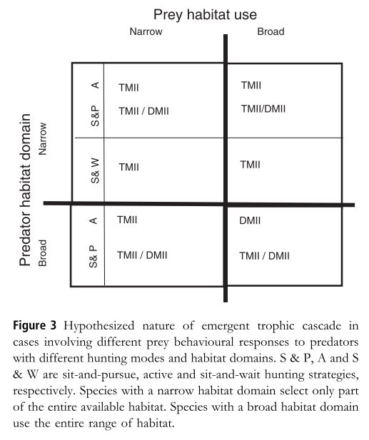
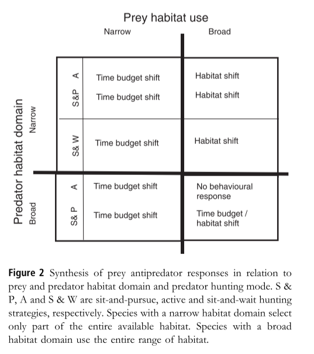

```{r, echo = FALSE, warning = FALSE}
library(ggplot2)
library(formatR)
library(knitr)
library(cowplot)
knitr::opts_chunk$set(tidy.opts = list(width.cutoff = 60), tidy = TRUE)
knitr::opts_chunk$set(warning = FALSE, message = FALSE) 
```

# About This Document

The version of the IREF included in the grant proposal attempts to tackle some of Os Schmitz's early 2000's work on how prey should respond to predators with different predator hunting modes (e.g., sit-and-wait, sit-and-pursue, active hunting). However, it leaves out an important additional aspect of Os's work: the presence of refugia from predation. Thus, **an important goal of this document is to determine whether we can take the IREF, which is not a spatiotemporally explicit model, and incorporate refugia in a way that is analogous to Os's informal verbal models on the subject.** 

Of particular importance to this question are the following figures, from his textbook (and Schmitz et al. 2004 Ecol Lett):




The IREF already covers the cases where the predator and prey fully overlap spatially, i.e., the left two quadrants, and arguably the lower right quadrant, although in a somewhat coarse way. This document will largely be focused on tackling the cases in the upper right quadrant, where the prey's spatial domain is larger than the predator's and therefore includes predator-free refugia. In these cases, Os argues that the prey should shift its habitat usage to the refuge regardless of the predator's hunting mode, and the system should be dominated by TMIIs except with sit-and-pursue predators, where it may also feature a blend of the two.

It should be noted as well that Os's version of a sit-and-wait predator may be somewhat rare in most terrestrial systems, because arguably a predator that does not move at all to locate prey is similar to a filter feeder. What we've been calling a "sit-and-wait" predator he might actually call a "sit-and-pursue" predator.
\pagebreak

# Model Description

For the following scenarios, we will explore a predator-prey system with a refuge from predation using the IREF. 

In brief, we will use the IREF to calculate the optimal amount of time for prey to spend in the refuge habitat (i.e., the proportion of time spent in the refuge will be the trait on the x-axis). To do so, we will assume that prey have some constant body velocity inside the refuge, and a separate constant velocity outside the refuge. We will derive these constant values for velocity by applying the IREF to each of the two habitat types separately.

In both sets of scenarios, we will use the following equation for calculating encounter rate ($Z$) between the predator and prey:

$$ Z = 2rN*sqrt(v^2 + s^2)$$

where $s$ is prey velocity (i.e., displacement rate), $v$ is predator velocity, $N$ is predator density, and $r$ is the radius within which the predator can perceive prey. We will use this as a proxy for the predator's average attack rate. This is similar to assuming that the predator has a Type I functional response, but in actuality, we are simply ignoring the effects of predator satiation on the interaction, because the IREF is not a temporally explicit model. A Type II functional response could be incorporated into the model, but it would add another parameter and would probably simply make the mortality-trait curve a more saturating relationship.

For simplicity, detection radius is kept constant such that $2r = 1$. We will also keep predator velocity ($v$) constant. In the baseline IREF simulation (Fig. 2 in the grant), $v = 0.2$, so we will use this value.

This leads to a mortality-trait curve that is slightly concave up with respect to prey body velocity, because at high prey displacement rate, encounters are driven largely by prey velocity, whereas at low prey displacement rate, encounters are driven largely by predator velocity.

```{r}
## The mortality-trait curve
# This forumula is simplified by setting some of the values as constants
# r is assumed to be 0.5 (which cancels out the 2), while k, v, and s are manipulated values
# k is predator density
# v is predator velocity
# s is prey velocity

pred.curve <- function(k, v, s){
 k * sqrt( v^2 + s^2 )
}
```

The growth-trait curve is determined by the rate at which the prey consumes its resource, $R$. This takes the form of a Type II functional response:

$$ f(R)= \frac{sR}{1 + shR}$$

where $s$ is prey displacement rate, $h$ is handling time, and $R$ is resource density. This results in a growth curve that is strongly concave down, because higher body velocity has diminishing returns due to time spent handling food.

```{r}
## The growth-trait curve
# R is prey resource density
# s is prey body velocity
# h is handling time

growth.curve <- function(s, h, R){
  ( s * R )/( 1 + s * h * R )
}
```
\pagebreak

# Deriving Prey Speed in Habitats A and B

We will begin by determining the rate at which the prey should forage inside and outside of the refuge. We'll start by generating the curves for the habitat outside the refuge --- we'll call it Habitat A. In Habitat A, predators are present at a moderate density ($k = 0.45$) but resources are plentiful ($R = 1$). We will assume prey handling time is constant, regardless of habitat choice ($h = 8$), and predator foraging rate will also be constant between habitats ($v = 0.2$).

This results in the following trait curves:

```{r, echo = FALSE}
# First, set up dataframe and important variables
speed.vec <- seq(0, 1, by = 0.01)
trait.vec <- 1 - speed.vec
habitatA.df <- as.data.frame( mat.or.vec( length( speed.vec ), 6) )
colnames(habitatA.df) <- c("trait", "speed", "growth_curve", "mort_curve", "fitness", "NCE_CE")
habitatA.df$trait <- trait.vec
habitatA.df$speed <- speed.vec

h_val <- 8 # prey handling time
R_val_A <- 1 # resource density outside of refuge
v_val <- 0.2 # predator velocity
k_val_A <- 0.45 # predator density outside refuge
cost_constant_val <- 9 # a constant Scott applied to the growth curve in the calcs to make the numbers cleaner
pred_constant_val <- 0.98058 # a constant Scott applied in the calcs to the mortality curve to make the numbers cleaner

# Derive the trait curves
habitatA.df$growth_curve <- cost_constant_val * growth.curve( s = habitatA.df$speed, R = R_val_A, h = h_val ) # Growth curve
habitatA.df$mort_curve <- pred_constant_val * pred.curve( k = k_val_A, v = v_val, s = habitatA.df$speed ) # Mortality curve
habitatA.df$fitness <- habitatA.df$growth_curve - habitatA.df$mort_curve # Fitness
habitatA.df$NCE_CE <- (1 - habitatA.df$growth_curve)/habitatA.df$mort_curve # NCE/CE

optim_A <- habitatA.df$trait[which(habitatA.df$fitness == max(habitatA.df$fitness))] # Location of optimum on x-axis
optim_fitness_A <- habitatA.df$fitness[which(habitatA.df$fitness == max(habitatA.df$fitness))] # Fitness at optimum
optim_CE_A <- habitatA.df$mort_curve[which(habitatA.df$fitness == max(habitatA.df$fitness))] # CE strength at optimum
optim_NCE_A <- 1 - optim_CE_A - optim_fitness_A #NCE strength at optimum

# Plot them
ggplot( data = habitatA.df, aes( x = trait ) ) +
  geom_smooth( aes( y = growth_curve, colour = "Growth"  ), se = FALSE) +
  geom_smooth( aes( y = mort_curve, colour = "Mortality" ), se = FALSE, linetype = "dashed" ) +
  geom_label(label = c("Habitat A"), x = 0.9, y = 0.95) +
  theme_classic( base_size = 10, base_line_size = 1 ) + 
  ylab("Growth and Mortality") +
  xlab("Displacement Rate") +
  geom_vline( xintercept = optim_A,  size = 0.5, linetype = "dashed", colour = "green" ) +
  annotate( "text", x = optim_A + 0.15, y = 0.55, label = paste0("s = ", (1 - optim_A) * 1000), size = 7/.pt  ) +
  scale_x_continuous(expand = c(0, 0), breaks = c(0, 0.5, 1), labels = c(1000, 500, 1) ) + 
  scale_y_continuous(expand = c(0, 0), limits = c(0, 1), breaks = c(0, 0.5, 1) ) +
  scale_colour_manual(name = "Curve", values = c("blue", "red")) +
  theme( panel.border = element_rect( color = "black", fill = NA, linewidth = 0.75 ), aspect.ratio = 1, legend.position = "bottom" )
```

Thus, in Habitat A, fitness (1 - NCE - CE) is optimized at a displacement rate of ~460 ($s = 0.46$).

In Habitat B, the refuge, predators are very rare ($k_B = 0.001$) but resources are far less plentiful ($R_B = 0.05$). This results in the following trait curves:

```{r, echo = FALSE}
# Repeat with new variable levels for Habitat B
habitatB.df <- as.data.frame( mat.or.vec( length( speed.vec ), 6) )
colnames(habitatB.df) <- c("trait", "speed", "growth_curve", "mort_curve", "fitness", "NCE_CE")
habitatB.df$trait <- trait.vec
habitatB.df$speed <- speed.vec


h_val <- 8 # prey handling time
R_val_B <- 0.1 # resource density outside of refuge
v_val <- 0.2 # predator velocity
k_val_B <- 0.001 # predator density outside refuge
cost_constant_val <- 9 # a constant Scott applied to the growth curve in the calcs to make the numbers cleaner
pred_constant_val <- 0.98058 # a constant Scott applied in the calcs to the mortality curve to make the numbers cleaner

# Derive the trait curves
habitatB.df$growth_curve <- cost_constant_val * growth.curve( s = habitatB.df$speed, R = R_val_B, h = h_val ) # Growth curve
habitatB.df$mort_curve <- pred_constant_val * pred.curve( k = k_val_B, v = v_val, s = habitatB.df$speed ) # Mortality curve
habitatB.df$fitness <- habitatB.df$growth_curve - habitatB.df$mort_curve # Fitness
habitatB.df$NCE_CE <- (1 - habitatB.df$growth_curve)/habitatB.df$mort_curve # NCE/CE

optim_B <- habitatB.df$trait[which(habitatB.df$fitness == max(habitatB.df$fitness))] # Location of optimum on x-axis
optim_fitness_B <- habitatA.df$fitness[which(habitatB.df$fitness == max(habitatB.df$fitness))] # Fitness at optimum
optim_CE_B <- habitatB.df$mort_curve[which(habitatB.df$fitness == max(habitatB.df$fitness))] # CE strength at optimum
optim_NCE_B <- 1 - optim_CE_B - optim_fitness_B #NCE strength at optimum

# Plot them
ggplot( data = habitatB.df, aes( x = trait ) ) +
  geom_smooth( aes( y = growth_curve, colour = "Growth"  ), se = FALSE) +
  geom_smooth( aes( y = mort_curve, colour = "Mortality" ), se = FALSE, linetype = "dashed" ) +
  geom_label(label = c("Habitat B"), x = 0.9, y = 0.95) +
  theme_classic( base_size = 10, base_line_size = 1 ) + 
  ylab("Growth and Mortality") +
  xlab("Displacement Rate") +
  geom_vline( xintercept = optim_B,  size = 0.5, linetype = "dashed", colour = "green" ) +
  annotate( "text", x = optim_B + 0.15, y = 0.55, label = paste0("s = ", (1 - optim_B) * 1000), size = 7/.pt  ) +
  scale_x_continuous(expand = c(0, 0), breaks = c(0, 0.5, 1), labels = c(1000, 500, 1) ) + 
  scale_y_continuous(expand = c(0, 0), limits = c(0, 1), breaks = c(0, 0.5, 1) ) +
  scale_colour_manual(name = "Curve", values = c("blue", "red")) +
  theme( panel.border = element_rect( color = "black", fill = NA, linewidth = 0.75 ), aspect.ratio = 1, legend.position = "bottom" )
```

In this set of curves, the optimal prey body velocity is at its maximum, in part because the mortality curve is very low and shallow. Having played around with the parameter space some, this seems to generally be the case for sufficiently low values of $k_B$, as shown below.

```{r, echo = FALSE}
k_sensitivity.df <- as.data.frame( mat.or.vec( length( speed.vec ), 7) )
colnames(k_sensitivity.df) <- c("trait", "speed", "growth_curve", "k_0.01", "k_0.1", "k_0.2", "k_0.3")
k_sensitivity.df$trait <- trait.vec
k_sensitivity.df$speed <- speed.vec

# Derive the trait curves
k_sensitivity.df$growth_curve <- cost_constant_val * growth.curve( s = k_sensitivity.df$speed, R = R_val_B, h = h_val ) # Growth curve
k_sensitivity.df$k_0.01 <- pred_constant_val * pred.curve( k = 0.01, v = v_val, s = k_sensitivity.df$speed ) # Mortality curve
k_sensitivity.df$k_0.1 <- pred_constant_val * pred.curve( k = 0.1, v = v_val, s = k_sensitivity.df$speed ) # Mortality curve
k_sensitivity.df$k_0.2 <- pred_constant_val * pred.curve( k = 0.2, v = v_val, s = k_sensitivity.df$speed ) # Mortality curve
k_sensitivity.df$k_0.3 <- pred_constant_val * pred.curve( k = 0.3, v = v_val, s = k_sensitivity.df$speed ) # Mortality curve


# Plot them
ggplot( data = k_sensitivity.df, aes( x = trait ) ) +
  geom_smooth( aes( y = growth_curve, colour = "Growth"  ), se = FALSE) +
  geom_smooth( aes( y = k_0.01, colour = "k = 0.01" ), se = FALSE, linetype = "dashed" ) +
  geom_smooth( aes( y = k_0.1, colour = "k = 0.1" ), se = FALSE, linetype = "dashed" ) +
  geom_smooth( aes( y = k_0.2, colour = "k = 0.2" ), se = FALSE, linetype = "dashed" ) +
  geom_smooth( aes( y = k_0.3, colour = "k = 0.3" ), se = FALSE, linetype = "dashed" ) +
  theme_classic( base_size = 10, base_line_size = 1 ) + 
  ylab("Growth and Mortality") +
  xlab("Displacement Rate") +
  scale_x_continuous(expand = c(0, 0), breaks = c(0, 0.5, 1), labels = c(1000, 500, 1) ) + 
  scale_y_continuous(expand = c(0, 0), limits = c(0, 1), breaks = c(0, 0.5, 1) ) +
  scale_colour_discrete(name = "Curve") +
  theme( panel.border = element_rect( color = "black", fill = NA, linewidth = 0.75 ), aspect.ratio = 1, legend.position = "bottom" )

# Even for k = 0.3, the optimum is very close to maximum speed
optim_k_0.3 <- k_sensitivity.df$trait[which((k_sensitivity.df$growth_curve - k_sensitivity.df$k_0.3) == max(k_sensitivity.df$growth_curve - k_sensitivity.df$k_0.3))]
```

Even for $k_B = 0.3$, which is somewhat close to Habitat A's $k_A = 0.45$, the prey's optimal body velocity is still close to the maximum ($s = 0.96$).

\pagebreak

# Optimizing Time Spent in Refuge

Now that we've predicted the optimal body velocity for prey in Habitats A and B, given their resource and predator densities differ, we can think about how prey might optimize the amount of time they spend in either habitat across a given period of time. To do so, we will set prey body velocity constant at the levels derived above ($s_A = 0.46$, $s_B = 1$) and consider what degree of refuge use (on the x-axis) will maximize fitness.

The growth curve in this case can be calculated by simply adding the amount of resources the prey can gather during its time in the refuge vs. outside of it.

```{r}
## Derive the trait curves
refuge.df <- as.data.frame( mat.or.vec( 25, 5 ) ) 
colnames(refuge.df) <- c("proptime", "growth_curve", "mort_curve", "fitness", "NCE_CE")
refuge.df$proptime <- seq(0, 1, by = 1/24) 

s_val_A <- 0.46
s_val_B <- 1

# Growth is additive, so this is simply (growth during time outside refuge + growth during time inside refuge)
growth_A_val <- growth.curve( s = s_val_A, R = R_val_A, h = 8 ) * cost_constant_val # Growth outside refuge during an hour
growth_B_val <- growth.curve( s = s_val_B, R = R_val_B, h = 8 ) * cost_constant_val # Growth inside refuge during an hour

# Growth curve
# Growth is additive, so this is simply (growth during time outside refuge + growth during time inside refuge)
refuge.df$growth_curve <- (1 - refuge.df$proptime) * growth_A_val + (refuge.df$proptime) * growth_B_val
```

For the mortality curve, because risk is multiplicative instead of additive, we will calculate it using a weighted geometric mean:

$$ \bar{x} = exp(\frac{\sum_{i = 1}^{n} w_{i}lnx_{i}}{\sum_{i=1}^{n} w_{i}}) $$

Because we are using a proportion to describe the amount of time spent in and out of the refuge habitat, $\sum_{i=1}^{n}w_{i}$ simplifies to 1, so the equation becomes:

$$ \bar{x} = exp(\sum_{i = 1}^{n} w_{i}lnx_{i}) $$
Note that because this formula requires taking the natural log of the risk function, we cannot set predator density in the refuge ($k_{refuge}$) to zero without running into some trouble. So, I have instead set predator density to 0.001.

```{r}
# Mortality curve
mort_val_A <- pred_constant_val * pred.curve( k = k_val_A, v = v_val, s = s_val_A ) # Mortality outside the refuge during an hour
mort_val_B <- pred_constant_val * pred.curve( k = k_val_B, v = v_val, s = s_val_B ) # Mortality inside the refuge during an hour

# Weighted mean of risk during time spent outside refuge + risk during time spent inside refuge
refuge.df$mort_curve <- exp( ( 1 - refuge.df$proptime ) * log( mort_val_A ) + ( refuge.df$proptime ) * log( mort_val_B ) )

# Calculate fitness and relative strength of NCEs and CEs
refuge.df$fitness <- 1 - ( 1 - refuge.df$growth_curve ) - refuge.df$mort_curve
refuge.df$NCE_CE <- refuge.df$growth_curve / refuge.df$mort_curve

# Some other important metrics
refuge_optim <- round(refuge.df$proptime[which(refuge.df$fitness == max(refuge.df$fitness))], digits = 2) # The level of refuge use (along x-axis) that fitness is optimized at
refuge_optim_fitness <- round(refuge.df$fitness[which(refuge.df$fitness == max(refuge.df$fitness))], digits = 2) # The fitness value at the optimum
refuge_optim_CE <- round(refuge.df$mort_curve[which(refuge.df$fitness == max(refuge.df$fitness))], digits = 2) # The strength of the CE at the optimum
refuge_optim_NCE <- round(1 - refuge_optim_CE - refuge_optim_fitness, digits = 2) # The strength of the NCE at the optimum
```

This results in the following trait curves and optimal strategy.

```{r, echo = FALSE}
ggplot( data = refuge.df, aes( x = proptime ) ) +
  geom_smooth( aes( y = growth_curve, colour = "Growth" ), se = FALSE ) +
  geom_smooth( aes( y = mort_curve, colour = "Mortality" ), se = FALSE, linetype = "dashed" ) +
  theme_classic( base_size = 10, base_line_size = 1 ) +   
  geom_vline( xintercept = refuge_optim,  size = 0.5, linetype = "dashed", colour = "green" ) +
  annotate( "text", x = refuge_optim + 0.15, y = 0.55, label = paste0("p = ", refuge_optim ), size = 7/.pt  ) +
  annotate( "text", x = 0.5, y = 0.95, label = "NCE = 0.21, CE = 0.07, Fitness = 0.72", size = 7/.pt  ) +
  ylab("Growth and Mortality") +
  xlab("Proportion of Time Spent in Refuge") +
  scale_x_continuous(expand = c(0, 0), breaks = c(0, 0.5, 1) ) + 
  scale_y_continuous(expand = c(0, 0), limits = c(0, 1), breaks = c(0, 0.5, 1) ) +
  scale_colour_manual(name = "Curve", values = c("blue", "red")) +
  theme( panel.border = element_rect( color = "black", fill = NA, linewidth = 0.75 ), aspect.ratio = 1)
```

In the above figure, the growth and mortality rates are shown as a function of the proportion of time that prey spend in the refuge. The blue line is the growth-trait curve, while the red dashed line is the mortality-trait curve. The optimal level of trait expression is noted with the vertical green dashed line.

The growth-trait curve is linear, because as time spent in the refuge increases, prey have proportionally less time to forage. On the other hand, the mortality-trait curve is saturating, because there are diminishing returns on how much prey can reduce their exposure to predators.
\pagebreak

# Incorporating Predator Foraging Mode

Looping back around to Os's work on the topic, a large part of his predictions had to do with what decisions a prey should make regarding foraging effort and refuge use given different predator foraging modes. In the above examples, I used $v = 0.2$, which is the level used in the grant proposal to represent a "sit-and-wait" style predator. Let's revisit his tables.



Os predicts that when the prey's habitat domain is larger than the predators (i.e., a refuge exists, the upper right quadrant), the prey should predominantly shift their habitat use to avoid predators regardless of their foraging mode. Here, we show that they should actually do a little bit of both depending on the relative risk and resource density present in either habitat. 

But what if prey are faced with a more active predator? Does the optimal strategy change, or does our model still agree with Os's? Let's repeat the above steps with a predator with a much higher foraging rate ($v = 1$), as in the grant proposal, and see if it changes our predictions.

Outside the refuge (Habitat A), the prey's optimal body velocity changes as follows:

```{r, echo = FALSE}
# First, set up dataframe and important variables
predmodeA.df <- as.data.frame( mat.or.vec( length( speed.vec ), 6) )
colnames(predmodeA.df) <- c("trait", "speed", "growth_curve", "mort_curve", "fitness", "NCE_CE")
predmodeA.df$trait <- trait.vec
predmodeA.df$speed <- speed.vec

v_val <- 1 # the only difference is predator velocity

# Derive the trait curves
predmodeA.df$growth_curve <- cost_constant_val * growth.curve( s = predmodeA.df$speed, R = R_val_A, h = h_val ) # Growth curve
predmodeA.df$mort_curve <- pred_constant_val * pred.curve( k = k_val_A, v = v_val, s = predmodeA.df$speed ) # Mortality curve
predmodeA.df$fitness <- predmodeA.df$growth_curve - predmodeA.df$mort_curve # Fitness
predmodeA.df$NCE_CE <- (1 - predmodeA.df$growth_curve)/predmodeA.df$mort_curve # NCE/CE

optim_A <- predmodeA.df$trait[which(predmodeA.df$fitness == max(predmodeA.df$fitness))] # Location of optimum on x-axis
optim_fitness_A <- predmodeA.df$fitness[which(predmodeA.df$fitness == max(predmodeA.df$fitness))] # Fitness at optimum
optim_CE_A <- predmodeA.df$mort_curve[which(predmodeA.df$fitness == max(predmodeA.df$fitness))] # CE strength at optimum
optim_NCE_A <- 1 - optim_CE_A - optim_fitness_A #NCE strength at optimum

# Plot them
ggplot( data = predmodeA.df, aes( x = trait ) ) +
  geom_smooth( aes( y = growth_curve, colour = "Growth"  ), se = FALSE) +
  geom_smooth( aes( y = mort_curve, colour = "Mortality" ), se = FALSE, linetype = "dashed" ) +
  geom_label(label = c("Habitat A"), x = 0.9, y = 0.95) +
  theme_classic( base_size = 10, base_line_size = 1 ) + 
  ylab("Growth and Mortality") +
  xlab("Displacement Rate") +
  geom_vline( xintercept = optim_A,  size = 0.5, linetype = "dashed", colour = "green" ) +
  annotate( "text", x = optim_A + 0.15, y = 0.55, label = paste0("s = ", (1 - optim_A) * 1000), size = 7/.pt  ) +
  scale_x_continuous(expand = c(0, 0), breaks = c(0, 0.5, 1), labels = c(1000, 500, 1) ) + 
  scale_y_continuous(expand = c(0, 0), limits = c(0, 1), breaks = c(0, 0.5, 1) ) +
  scale_colour_manual(name = "Curve", values = c("blue", "red")) +
  theme( panel.border = element_rect( color = "black", fill = NA, linewidth = 0.75 ), aspect.ratio = 1, legend.position = "bottom" )
```

The optimum is higher, in line with what we expect from both Os's predictions and our own IREF predictions. Meanwhile, inside the refuge, the prey's optimal body velocity predator density is too low to shift the optimal prey velocity away from full speed.

```{r, echo = FALSE}
# First, set up dataframe and important variables
predmodeB.df <- as.data.frame( mat.or.vec( length( speed.vec ), 6) )
colnames(predmodeB.df) <- c("trait", "speed", "growth_curve", "mort_curve", "fitness", "NCE_CE")
predmodeB.df$trait <- trait.vec
predmodeB.df$speed <- speed.vec

# Derive the trait curves
predmodeB.df$growth_curve <- cost_constant_val * growth.curve( s = predmodeB.df$speed, R = R_val_B, h = h_val ) # Growth curve
predmodeB.df$mort_curve <- pred_constant_val * pred.curve( k = k_val_B, v = v_val, s = predmodeB.df$speed ) # Mortality curve
predmodeB.df$fitness <- predmodeB.df$growth_curve - predmodeB.df$mort_curve # Fitness
predmodeB.df$NCE_CE <- (1 - predmodeB.df$growth_curve)/predmodeB.df$mort_curve # NCE/CE

optim_B <- predmodeB.df$trait[which(predmodeB.df$fitness == max(predmodeB.df$fitness))] # Location of optimum on x-axis
optim_fitness_B <- predmodeB.df$fitness[which(predmodeB.df$fitness == max(predmodeB.df$fitness))] # Fitness at optimum
optim_CE_B <- predmodeB.df$mort_curve[which(predmodeB.df$fitness == max(predmodeB.df$fitness))] # CE strength at optimum
optim_NCE_B <- 1 - optim_CE_A - optim_fitness_A #NCE strength at optimum

# Plot them
ggplot( data = predmodeB.df, aes( x = trait ) ) +
  geom_smooth( aes( y = growth_curve, colour = "Growth"  ), se = FALSE) +
  geom_smooth( aes( y = mort_curve, colour = "Mortality" ), se = FALSE, linetype = "dashed" ) +
  geom_label(label = c("Habitat B"), x = 0.9, y = 0.95) +
  theme_classic( base_size = 10, base_line_size = 1 ) + 
  ylab("Growth and Mortality") +
  xlab("Displacement Rate") +
  geom_vline( xintercept = optim_B,  size = 0.5, linetype = "dashed", colour = "green" ) +
  annotate( "text", x = optim_B + 0.15, y = 0.55, label = paste0("s = ", (1 - optim_B) * 1000), size = 7/.pt  ) +
  scale_x_continuous(expand = c(0, 0), breaks = c(0, 0.5, 1), labels = c(1000, 500, 1) ) + 
  scale_y_continuous(expand = c(0, 0), limits = c(0, 1), breaks = c(0, 0.5, 1) ) +
  scale_colour_manual(name = "Curve", values = c("blue", "red")) +
  theme( panel.border = element_rect( color = "black", fill = NA, linewidth = 0.75 ), aspect.ratio = 1, legend.position = "bottom" )
```

And the optimal proportion of time spent in the refuge, given these prey body velocity values, is...

```{r, echo = FALSE}
predmode.df <- as.data.frame( mat.or.vec( 25, 5 ) ) 
colnames(predmode.df) <- c("proptime", "growth_curve", "mort_curve", "fitness", "NCE_CE")
predmode.df$proptime <- seq(0, 1, by = 1/24) 

s_val_A <- 0.64
s_val_B <- 1
v_val <- 1

# Growth is additive, so this is simply (growth during time outside refuge + growth during time inside refuge)
growth_A_val <- growth.curve( s = s_val_A, R = R_val_A, h = h_val ) * cost_constant_val # Growth outside refuge during an hour
growth_B_val <- growth.curve( s = s_val_B, R = R_val_B, h = h_val ) * cost_constant_val # Growth inside refuge during an hour

# Growth curve
# Growth is additive, so this is simply (growth during time outside refuge + growth during time inside refuge)
predmode.df$growth_curve <- (1 - predmode.df$proptime) * growth_A_val + (predmode.df$proptime) * growth_B_val

# Mortality curve
mort_val_A <- pred_constant_val * pred.curve( k = k_val_A, v = v_val, s = s_val_A ) # Mortality outside the refuge during an hour
mort_val_B <- pred_constant_val * pred.curve( k = k_val_B, v = v_val, s = s_val_B ) # Mortality inside the refuge during an hour

# Weighted mean of risk during time spent outside refuge + risk during time spent inside refuge
predmode.df$mort_curve <- exp( ( 1 - predmode.df$proptime ) * log( mort_val_A ) + ( predmode.df$proptime ) * log( mort_val_B ) )

# Calculate fitness and relative strength of NCEs and CEs
predmode.df$fitness <- 1 - ( 1 - predmode.df$growth_curve ) - predmode.df$mort_curve
predmode.df$NCE_CE <- predmode.df$growth_curve / predmode.df$mort_curve

# Some other important metrics
refuge_optim <- round(predmode.df$proptime[which(predmode.df$fitness == max(predmode.df$fitness))], digits = 2) # The level of refuge use (along x-axis) that fitness is optimized at
refuge_optim_fitness <- round(predmode.df$fitness[which(predmode.df$fitness == max(predmode.df$fitness))], digits = 2) # The fitness value at the optimum
refuge_optim_CE <- round(predmode.df$mort_curve[which(predmode.df$fitness == max(predmode.df$fitness))], digits = 2) # The strength of the CE at the optimum
refuge_optim_NCE <- round(1 - refuge_optim_CE - refuge_optim_fitness, digits = 2) # The strength of the NCE at the optimum

ggplot( data = predmode.df, aes( x = proptime ) ) +
  geom_smooth( aes( y = growth_curve, colour = "Growth" ), se = FALSE ) +
  geom_smooth( aes( y = mort_curve, colour = "Mortality" ), se = FALSE, linetype = "dashed" ) +
  theme_classic( base_size = 10, base_line_size = 1 ) +   
  geom_vline( xintercept = refuge_optim,  size = 0.5, linetype = "dashed", colour = "green" ) +
  annotate( "text", x = refuge_optim + 0.15, y = 0.55, label = paste0("p = ", refuge_optim ), size = 7/.pt  ) +
  annotate( "text", x = 0.5, y = 0.95, label = "NCE = 0.21, CE = 0.07, Fitness = 0.72", size = 7/.pt  ) +
  ylab("Growth and Mortality") +
  xlab("Proportion of Time Spent in Refuge") +
  scale_x_continuous(expand = c(0, 0), breaks = c(0, 0.5, 1) ) + 
  scale_y_continuous(expand = c(0, 0), limits = c(0, 1), breaks = c(0, 0.5, 1) ) +
  scale_colour_manual(name = "Curve", values = c("blue", "red")) +
  theme( panel.border = element_rect( color = "black", fill = NA, linewidth = 0.75 ), aspect.ratio = 1)
```

The IREF predicts that the prey should spend more time in the refuge faced with the active predator vs. the sit-and-wait predator ($p_{opt} = 0.33$ and $p_{opt} = 0.21$, respectively). This seems a little counter-intuitive at first, and may need some picking apart to explain. I think it relates in part to the fact that in this parameter space, a predator with a higher foraging rate is inherently more lethal. Consider the following mortality curves:

```{r, echo = FALSE}
# First, set up dataframe and important variables
predmode_sens.df <- as.data.frame( mat.or.vec( length( speed.vec ), 4) )
colnames(predmode_sens.df) <- c("trait", "speed", "v_0.2", "v_1.0" )
predmode_sens.df$trait <- trait.vec
predmode_sens.df$speed <- speed.vec

v_val_A <- 0.2
v_val_B <- 1 # the only difference is predator velocity

# Derive the trait curves
predmode_sens.df$v_0.2 <- pred_constant_val * pred.curve( k = k_val_A, v = v_val_A, s = predmode_sens.df$speed ) # Mortality curve A
predmode_sens.df$v_1.0 <- pred_constant_val * pred.curve( k = k_val_A, v = v_val_B, s = predmode_sens.df$speed ) # Mortality curve B

# Plot them
ggplot( data = predmode_sens.df, aes( x = trait ) ) +
  geom_smooth( aes( y = v_0.2, colour = "0.2"  ), se = FALSE, linetype = "dashed" ) +
  geom_smooth( aes( y = v_1.0, colour = "1" ), se = FALSE, linetype = "dashed" ) +
  theme_classic( base_size = 10, base_line_size = 1 ) + 
  ylab("Mortality Rate") +
  xlab("Displacement Rate") +
  scale_x_continuous(expand = c(0, 0), breaks = c(0, 0.5, 1), labels = c(1000, 500, 1) ) + 
  scale_y_continuous(expand = c(0, 0), limits = c(0, 1), breaks = c(0, 0.5, 1) ) +
  scale_colour_discrete(name = "v") +
  theme( panel.border = element_rect( color = "black", fill = NA, linewidth = 0.75 ), aspect.ratio = 1, legend.position = "bottom" )
```

The mortality curve for predator with the higher body velocity is not only shallower, but it is shifted up along the y-axis, i.e., that predator is simply more lethal. So, due to this difference in lethality, the optimal solution is to spend more time "hiding out" in the refuge away from the predator with the higher search rate. 

It may also line up with Os's predictions in his Fig. 3 above, where he suggests that a sit-and-pursue predator might have stronger DMIIs relative to TMIIs than an active predator (upper right quadrant). Note, however, that the calculated values for NCE and CE strength, as well as fitness, are basically the same between the two predator foraging modes.

## Exploring Parameter Space

What is the optimal amount of time spent in the refuge by prey, given varying levels of predator velocity? Is there a trend there?

```{r, echo = FALSE}
v_vec <- seq(0, 1, by = 0.1)
proptime_vec <- seq( 0, 1, by = 1/24 )
refuge_sens.df <- as.data.frame( mat.or.vec( length( v_vec ), 5) )
colnames(refuge_sens.df) <- c("v", "speed_A", "speed_B", "proptime", "fitness" )

habitatCurve.df <- as.data.frame(mat.or.vec( length( speed.vec), 3) )
colnames(habitatCurve.df) <- c("speed", "trait", "fitness")
habitatCurve.df$speed <- speed.vec
habitatCurve.df$trait <- trait.vec

proptimeCurve.df<- as.data.frame(mat.or.vec( length( proptime_vec ), 4) )
colnames(proptimeCurve.df) <- c("proptime", "growth", "mort", "fitness")
proptimeCurve.df$proptime <- proptime_vec

for (i in 1:length(v_vec)){
  # Derive optimal speed in habitat A and B
  refuge_sens.df[i,1] <- v_vec[i]
  
  habitatCurve.df$fitness <- cost_constant_val * growth.curve(s = speed.vec, h = 8, R = 1) - 
      pred_constant_val * pred.curve(k = 0.45, v = v_vec[i], s = speed.vec)
  refuge_sens.df[i,2] <- habitatCurve.df$speed[which(habitatCurve.df$fitness == max(habitatCurve.df$fitness))]
  
  habitatCurve.df$fitness <- cost_constant_val * growth.curve(s = speed.vec, h = 8, R = 0.1) - 
      pred_constant_val * pred.curve(k = 0.001, v = v_vec[i], s = speed.vec)
  refuge_sens.df[i,3] <- habitatCurve.df$speed[which(habitatCurve.df$fitness == max(habitatCurve.df$fitness))]
  
  
    # Growth is additive, so this is simply (growth during time outside refuge + growth during time inside refuge)
  growth_A_val <- growth.curve( s = refuge_sens.df[i,2], R = 1, h = 8 ) * cost_constant_val # Growth outside refuge during an hour
  growth_B_val <- growth.curve( s = refuge_sens.df[i,3], R = 0.1, h = 8 ) * cost_constant_val # Growth inside refuge during an hour
  proptimeCurve.df$growth <- (1 - proptimeCurve.df$proptime) * growth_A_val + (proptimeCurve.df$proptime) * growth_B_val

  # Mortality curve
  mort_val_A <- pred_constant_val * pred.curve( k = 0.45, v = v_vec[i], s = refuge_sens.df[i,2] ) # Mortality outside the refuge during an hour
  mort_val_B <- pred_constant_val * pred.curve( k = 0.001, v = v_vec[i], s = refuge_sens.df[i,3] ) # Mortality inside the refuge during an hour
  proptimeCurve.df$mort <- exp( ( 1 - proptimeCurve.df$proptime ) * log( mort_val_A ) + ( proptimeCurve.df$proptime ) * log( mort_val_B ) )

  # Calculate fitness and relative strength of NCEs and CEs
  proptimeCurve.df$fitness <- 1 - ( 1 - proptimeCurve.df$growth ) - proptimeCurve.df$mort

  refuge_sens.df[i,4] <- proptimeCurve.df$proptime[which(proptimeCurve.df$fitness == max(proptimeCurve.df$fitness))]
  refuge_sens.df[i,5] <- max( proptimeCurve.df$fitness )
}

plot(x = refuge_sens.df$v, refuge_sens.df$proptime)
```

Optimal proportion of time spent in refuge increases with predator body velocity, as does speed outside the refuge.