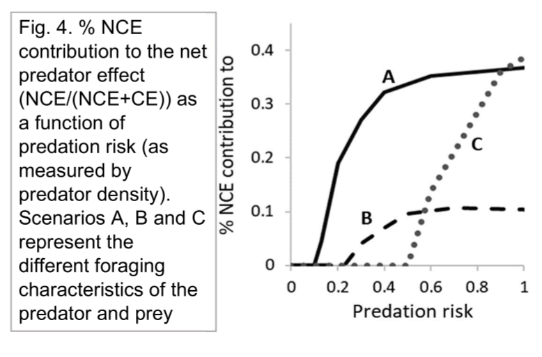

```{r, include=FALSE}
library(ggplot2)
library(dplyr)
```


This document contains an attempt to explore how the relative contribution of NCEs to the total predator effect varies across a risk gradient. This is similar to Fig. 4 in the grant proposal, which uses predator density as a proxy for risk.



Notably, the curves generally reach a saturation point, where the contribution of NCEs to the total predator effect levels off with increasing risk. One goal of this document is determining why the percentage of the total predator effect composed of the NCE generally levels off given increasing risk.

\pagebreak

# Exploring the Mechanisms

We will first recreate curve A in the above figure, but on a finer scale. Specifically, we will look at the underlying IREF curves and their shapes to determine why this relationship saturates with increasing risk. In the following figures, the only parameter being changed is predator density, with all other parameters (predator displacement rate, prey handling time, etc.) are held constant.

This uses the following equations for the mortality and growth curves, respectively, as in the grant:

$$ Z = 2rN*sqrt(v^2 + s^2)$$

where $Z$ is the encounter rate between the predator and prey, $s$ is prey speed (i.e., displacement rate), $v$ is predator speed, $N$ is predator density, and $r$ is the radius within which the predator can perceive prey; and:

$$ f(R)= \frac{sR}{1 + shR}$$
where $f(R)$ is the growth curve, $s$ is prey displacement rate, $h$ is handling time, and $R$ is resource density.

\pagebreak

```{r, warning = FALSE}
# Setting the range of prey displacement rate
trait.vec <- seq(0, 1, by = 0.01)
speed.vec <- 1 - trait.vec

# These formulas are simplified by setting some of the values as constants
# r is always assumed to be 1, while k, s, and v are manipulated values
pred.curve <- function(k, v, s){
  k*sqrt(v^2 + s^2)
}

# R is always assumed to be 1, while s and h are manipulated values
growth.curve <- function(s, R, h){
  (R * s)/(1 + s*R*h)
}

k_vec <- c(0, 0.1, 0.13, 0.2, 0.3, 0.4, 0.6, 1, 1.5, 2, 3, 5) # Range of values used by Scott for Fig. 4 in the grant proposal
h_val <- 8
R_val <- 1
cost_constant_val <- 9
v_val <- 0.2
pred_constant_val <- 0.98058

# Generate growth and mortality curves for each value of predator density (k_vec)
fig4.df <- as.data.frame( mat.or.vec( length( trait.vec ) * length(k_vec), 7) )
colnames(fig4.df) <- c("trait", "speed", "growth_curve", "mort_curve", "fitness", "pct_NCE", "pred_dens")

row <- 0

for (i in 1:length(k_vec)){
  for (j in 1:length(trait.vec)){
    row <- row + 1
    fig4.df[row, 1] <- trait.vec[j]
    fig4.df[row, 2] <- speed.vec[j]
    fig4.df[row, 3] <- cost_constant_val * growth.curve( s = fig4.df[row, 2], R = R_val, h = h_val )
    fig4.df[row, 4] <- pred_constant_val * pred.curve( k = k_vec[i], v = v_val, s = fig4.df[row, 2] )
    fig4.df[row, 5] <- fig4.df[row, 3] - fig4.df[row, 4]
    fig4.df[row, 6] <- (1 - fig4.df[row, 3])/((1 - fig4.df[row, 3]) + fig4.df[row, 4])
    fig4.df[row, 7] <- k_vec[i]
  }
}
```

First, we will look at the NCE's relative contribution to the total predator effect at the optimal RITR, as a function of predator density.

```{r, warning=FALSE, echo=FALSE}
# Summarize data by finding optimum fitness for each value of predator density
optim.df <- fig4.df %>%
  group_by( pred_dens ) %>%
  slice( which.max(fitness) )

optim.df$optim_val <- optim.df$trait
optim.df$optim_NCE <- optim.df$growth_curve
optim.df$optim_CE <- optim.df$mort_curve
optim.df$optim_fitness <- optim.df$fitness

fig4.df$pred_dens <- as.factor(fig4.df$pred_dens)
optim.df[1, 6] <- 0 # Removing an NA created by dividing by zero where pred_dens = 0


# Plot % contribution of NCE to total predator effect by predator density
ggplot( data = optim.df, aes( x = pred_dens ) ) +
  geom_point( aes( y = pct_NCE ) ) +
  theme_classic( base_size = 10, base_line_size = 1 ) + 
  ylab("% NCE contribution to") +
  xlab("Predator Density") +
  theme( panel.border = element_rect( color = "black", fill = NA, linewidth = 0.75 ), aspect.ratio = 1)
```
**Fig. 2.**: The proportion of the total predator effect made up of NCEs, as a function of increasing predator density (i.e., predation risk).

This shows an initially saturating relationship as seen in the grant figure (Fig. 1), but I've gone beyond the range of densities used there. This shows that it is actually a hump-shaped relationship that begins to decline with increasing density. 

Next, we'll look under the hood at the underlying IREF curves and the optimal RITRs, as a function of predator density.

```{r, warning=FALSE, echo=FALSE}
# Plot IREF curves by predator density
ggplot( data = fig4.df, aes( x = trait ) ) +
  geom_line( aes( y = growth_curve ), color = "blue" ) +
  geom_line( aes( y = mort_curve ), color = "red" ) +
  theme_classic( base_size = 7, base_line_size = 1 ) + 
  ylab("Growth and Mortality") +
  xlab("Displacement Rate") +  
  geom_rect( data = optim.df, aes(xmin = optim_val - 0.025, xmax = optim_val + 0.025, ymin = optim_NCE, ymax = 0.998), color = "gray2", fill = "lightblue", alpha = 0.5) +
  geom_rect( data = optim.df, aes(xmin = optim_val - 0.025, xmax = optim_val + 0.025, ymin = 0.001, ymax = optim_CE), color = "gray2", fill = "red", alpha = 0.5) +  
  geom_rect( data = optim.df, aes(xmin = optim_val - 0.025, xmax = optim_val + 0.025, ymin = optim_CE, ymax = optim_NCE), color = "gray2", fill = "lightgreen", alpha = 0.5) +
  scale_x_continuous(expand = c(0, 0), breaks = c(0, 0.5, 1), labels = c(1000, 500, 1) ) + 
  scale_y_continuous(expand = c(0, 0), limits = c(0, 1), breaks = c(0, 0.5, 1) ) +
  facet_wrap(~pred_dens) +
  theme( panel.border = element_rect( color = "black", fill = NA, linewidth = 0.75 ), aspect.ratio = 1 )
```
**Fig. 3**: Growth and mortality curves (blue and red, respectively) as a function of predator density (noted in the header above the plot). The optimal RITR is noted using a bar, where the green shaded region is fitness (1 - NCE - CE), the blue shaded region is NCE strength, and the red shaded region is CE strength. The bars eventually "fall apart" at very high predator densities ($k$ > 3) because fitness goes negative.

The reason that the NCE's contribution to the total predator effect tends to exhibit a hump-shaped relationship with predator density depends on the relative costs and benefits of the RITR.

Increasing risk generally shifts the optimal RITR towards the right (i.e., towards less prey activity), but there is a limit to how strongly the prey can respond. This is determined by the point at which the slope of the growth curve exceeds the slope of the mortality curve.

The proportion of the total predator effect composed of NCEs eventually declines, because as predator density increases, CEs continue to grow while NCEs are bounded by a prey displacement rate of zero.

```{r, warning = FALSE, echo=FALSE}
ggplot( data = optim.df, aes( x = pred_dens ) ) +
  geom_point( aes( y = optim_CE ), colour = "red" ) +
  geom_point( aes( y = 1 - optim_NCE ), colour = "blue" ) +
  theme_classic( base_size = 10, base_line_size = 1 ) + 
  ylab("Effect Size") +
  xlab("Predator Density") +
  scale_y_continuous(expand = c(0, 0), limits = c(0, 1.2), breaks = c(0, 0.5, 1) ) +
  theme( panel.border = element_rect( color = "black", fill = NA, linewidth = 0.75 ), aspect.ratio = 1)
```
**Fig. 4**: The effect size of NCEs (blue points) and CEs (red points) as a function of predator density at the optimal RITR.

This finding is probably general in cases where the growth curve is concave-down, while predation risk declines in a linear or saturating way.

\pagebreak

# What About Other Functional Forms for the Growth Curve?

Are the above findings general to other forms of the growth curve? For example, what if the relationship between prey growth and trait expression is linear?

```{r, warning = FALSE}
k_vec <- c(0, 0.1, 0.13, 0.2, 0.3, 0.4, 0.6, 1, 1.5, 2, 3, 5) # Range of values used by Scott for Fig. 4 in the grant proposal
h_val <- 8
R_val <- 1
cost_constant_val <- 9
v_val <- 0.2
pred_constant_val <- 0.98058
growthcurve_vec <- seq(1, 0, by = -0.01) # Linear growth curve with decreasing displacement rate

# Generate growth and mortality curves for each value of predator density (k_vec)
lin_growth.df <- as.data.frame( mat.or.vec( length( trait.vec ) * length(k_vec), 7) )
colnames(lin_growth.df) <- c("trait", "speed", "growth_curve", "mort_curve", "fitness", "pct_NCE", "pred_dens")

row <- 0

for (i in 1:length(k_vec)){
  for (j in 1:length(trait.vec)){
    row <- row + 1
    lin_growth.df[row, 1] <- trait.vec[j]
    lin_growth.df[row, 2] <- speed.vec[j]
    lin_growth.df[row, 3] <- growthcurve_vec[j]
    lin_growth.df[row, 4] <- pred_constant_val * pred.curve( k = k_vec[i], v = v_val, s = lin_growth.df[row, 2] )
    lin_growth.df[row, 5] <- lin_growth.df[row, 3] - lin_growth.df[row, 4]
    lin_growth.df[row, 6] <- (1 - lin_growth.df[row, 3])/((1 - lin_growth.df[row, 3]) + lin_growth.df[row, 4])
    lin_growth.df[row, 7] <- k_vec[i]
  }
}
```
```{r, warning = FALSE, echo = FALSE}
# Summarize data by finding optimum fitness for each value of predator density
optim_linear.df <- lin_growth.df %>%
  group_by( pred_dens ) %>%
  slice( which.max(fitness) )

optim_linear.df$optim_val <- optim_linear.df$trait
optim_linear.df$optim_NCE <- optim_linear.df$growth_curve
optim_linear.df$optim_CE <- optim_linear.df$mort_curve
optim_linear.df$optim_fitness <- optim_linear.df$fitness

fig4.df$pred_dens <- as.factor(fig4.df$pred_dens)
optim_linear.df[1, 6] <- 0 # Removing an NA created by dividing by zero where pred_dens = 0

# Plot IREF curves by predator density
ggplot( data = lin_growth.df, aes( x = trait ) ) +
  geom_line( aes( y = growth_curve ), color = "blue" ) +
  geom_line( aes( y = mort_curve ), color = "red" ) +
  theme_classic( base_size = 7, base_line_size = 1 ) + 
  ylab("Growth and Mortality") +
  xlab("Displacement Rate") +  
  geom_rect( data = optim_linear.df, aes(xmin = optim_val - 0.025, xmax = optim_val + 0.025, ymin = optim_NCE, ymax = 0.998), color = "gray2", fill = "lightblue", alpha = 0.5) +
  geom_rect( data = optim_linear.df, aes(xmin = optim_val - 0.025, xmax = optim_val + 0.025, ymin = 0.001, ymax = optim_CE), color = "gray2", fill = "red", alpha = 0.5) +  
  geom_rect( data = optim_linear.df, aes(xmin = optim_val - 0.025, xmax = optim_val + 0.025, ymin = optim_CE, ymax = optim_NCE), color = "gray2", fill = "lightgreen", alpha = 0.5) +
  scale_x_continuous(expand = c(0, 0), breaks = c(0, 0.5, 1), labels = c(1000, 500, 1) ) + 
  scale_y_continuous(expand = c(0, 0), limits = c(0, 1), breaks = c(0, 0.5, 1) ) +
  facet_wrap(~pred_dens) +
  theme( panel.border = element_rect( color = "black", fill = NA, linewidth = 0.75 ), aspect.ratio = 1 )
```
**Fig. 5**: Growth and mortality curves (blue and red, respectively) as a function of predator density (noted in the header above the plot). The optimal RITR is noted using a bar, where the green shaded region is fitness (1 - NCE - CE), the blue shaded region is NCE strength, and the red shaded region is CE strength.

Because the chosen slope of the growth curve is always greater than the slope of the mortality curve, the optimal RITR is zero until the mortality curve exceeds the growth curve ($k > 1.5$).
\pagebreak

What about a sigmoid growth curve? Using the following general formula:

$$f(R) = \frac{1}{1 + e^{a(sR-0.5)}}$$

where $a$ sets the steepness of the function (here, $a$ = 8), $s$ is prey displacement rate, and $R$ is resource density, held constant at 1. These values are arbitrary and can be manipulated as needed.

```{r, warning = FALSE}
sig_growth.fun <- function(s){
  1 / ( 1 + exp(8*(s - 0.5)) )
}

k_vec <- c(0, 0.1, 0.13, 0.2, 0.3, 0.4, 0.6, 1, 1.5, 2, 3, 5) # Range of values used by Scott for Fig. 4 in the grant proposal
h_val <- 8
R_val <- 1
cost_constant_val <- 9
v_val <- 0.2
pred_constant_val <- 0.98058
growthcurve_vec <- sig_growth.fun(s = trait.vec) # Linear growth curve with decreasing displacement rate

# Generate growth and mortality curves for each value of predator density (k_vec)
sig_growth.df <- as.data.frame( mat.or.vec( length( trait.vec ) * length(k_vec), 7) )
colnames(sig_growth.df) <- c("trait", "speed", "growth_curve", "mort_curve", "fitness", "pct_NCE", "pred_dens")

row <- 0

for (i in 1:length(k_vec)){
  for (j in 1:length(trait.vec)){
    row <- row + 1
    sig_growth.df[row, 1] <- trait.vec[j]
    sig_growth.df[row, 2] <- speed.vec[j]
    sig_growth.df[row, 3] <- growthcurve_vec[j]
    sig_growth.df[row, 4] <- pred_constant_val * pred.curve( k = k_vec[i], v = v_val, s = sig_growth.df[row, 2] )
    sig_growth.df[row, 5] <- sig_growth.df[row, 3] - sig_growth.df[row, 4]
    sig_growth.df[row, 6] <- (1 - sig_growth.df[row, 3])/((1 - sig_growth.df[row, 3]) + sig_growth.df[row, 4])
    sig_growth.df[row, 7] <- k_vec[i]
  }
}

# Summarize data by finding optimum fitness for each value of predator density
optim_sig.df <- sig_growth.df %>%
  group_by( pred_dens ) %>%
  slice( which.max(fitness) )

optim_sig.df$optim_val <- optim_sig.df$trait
optim_sig.df$optim_NCE <- optim_sig.df$growth_curve
optim_sig.df$optim_CE <- optim_sig.df$mort_curve
optim_sig.df$optim_fitness <- optim_sig.df$fitness

sig_growth.df$pred_dens <- as.factor(sig_growth.df$pred_dens)
optim_sig.df[1, 6] <- 0 # Removing an NA created by dividing by zero where pred_dens = 0

# Plot IREF curves by predator density
ggplot( data = sig_growth.df, aes( x = trait ) ) +
  geom_line( aes( y = growth_curve ), color = "blue" ) +
  geom_line( aes( y = mort_curve ), color = "red" ) +
  theme_classic( base_size = 7, base_line_size = 1 ) + 
  ylab("Growth and Mortality") +
  xlab("Displacement Rate") +  
  geom_rect( data = optim_sig.df, aes(xmin = optim_val - 0.025, xmax = optim_val + 0.025, ymin = optim_NCE, ymax = 0.998), color = "gray2", fill = "lightblue", alpha = 0.5) +
  geom_rect( data = optim_sig.df, aes(xmin = optim_val - 0.025, xmax = optim_val + 0.025, ymin = 0.001, ymax = optim_CE), color = "gray2", fill = "red", alpha = 0.5) +  
  geom_rect( data = optim_sig.df, aes(xmin = optim_val - 0.025, xmax = optim_val + 0.025, ymin = optim_CE, ymax = optim_NCE), color = "gray2", fill = "lightgreen", alpha = 0.5) +
  scale_x_continuous(expand = c(0, 0), breaks = c(0, 0.5, 1), labels = c(1000, 500, 1) ) + 
  scale_y_continuous(expand = c(0, 0), limits = c(0, 1), breaks = c(0, 0.5, 1) ) +
  facet_wrap(~pred_dens) +
  theme( panel.border = element_rect( color = "black", fill = NA, linewidth = 0.75 ), aspect.ratio = 1 )
```
**Fig. 6**: Growth and mortality curves (blue and red, respectively) as a function of predator density (noted in the header above the plot). The optimal RITR is noted using a bar, where the green shaded region is fitness (1 - NCE - CE), the blue shaded region is NCE strength, and the red shaded region is CE strength.

Similar behavior to the original Type II growth curve, but the optimal RITR is usually on the top part of the "S", until predator density gets very high.

\pagebreak

# What if the Predator has a Type II Functional Response?

Next, I want to explore whether the above finding would change if the predator had a Type II functional response, as is typical for most predators. This may help to establish whether this finding is "general" to the majority of predator-prey systems. 

I expect that this will change the mortality curve primarily when prey displacement rate ($s$) is high. At high prey displacement rates, predator handling time will cause the mortality curve to be lower than with a Type I functional response. The optimal RITR will differ most from the Type I functional response examples above in this "saturating" region at high prey displacement rates, where it may take a larger reduction in prey displacement rate for the costs to growth to outweigh the benefits in terms of reduction of mortality.

To explore this, I have taken the encounter rate equation above and nested it inside of a Type II functional response:

$$ f(C)= \frac{ZC}{1 + Zh_{pred}C} $$

where $f(C)$ is the mortality curve, $Z$ is the predator's encounter rate with its prey, $h_{pred}$ is the predator's handling time, and $C$ is prey density.

We'll start with an (arbitrary) predator handling time ($h_{pred}$) of 5, while holding most other parameters constant (including prey density, but see below). I say "most", because I had to adjust the scaling constant used to determine baseline predation rates from ~1 to 5, because the introduction of handling time to the equation strongly reduced predator feeding rates.

```{r, warning=FALSE}

# First, write a new Type II mortality curve
# This function will take the above encounter rate formula and apply handling time to it
typeII.curve <- function( a_pred, h_pred ){
  a_pred / ( 1 + a_pred * h_pred )
}

k_vec <- c(0, 0.1, 0.13, 0.2, 0.3, 0.4, 0.6, 1, 2, 3, 5) # Range of values used by Scott for Fig. 4 in the grant proposal
h_val <- 8
h_pred_val <- 5 # Start at a predator handling time value of 5
R_val <- 1
cost_constant_val <- 9
v_val <- 0.2
pred_constant_val <- 5

# Generate growth and mortality curves for each value of predator density (k_vec)
typeII.df <- as.data.frame( mat.or.vec( length( trait.vec ) * length(k_vec), 7) )
colnames(typeII.df) <- c("trait", "speed", "growth_curve", "mort_curve", "fitness", "pct_NCE", "pred_dens")

row <- 0

for (i in 1:length(k_vec)){
  for (j in 1:length(trait.vec)){
    row <- row + 1
    typeII.df[row, 1] <- trait.vec[j]
    typeII.df[row, 2] <- speed.vec[j]
    typeII.df[row, 3] <- cost_constant_val * growth.curve( s = typeII.df[row, 2], R = R_val, h = h_val )
    typeII.df[row, 4] <- pred_constant_val * typeII.curve( a_pred = pred.curve( k = k_vec[i], v = v_val, s = typeII.df[row, 2]), h_pred = h_pred_val )
    typeII.df[row, 5] <- typeII.df[row, 3] - typeII.df[row, 4]
    typeII.df[row, 6] <- (1 - typeII.df[row, 3])/((1 - typeII.df[row, 3]) + typeII.df[row, 4])
    typeII.df[row, 7] <- k_vec[i]
  }
}
```

```{r, warning=FALSE, echo=FALSE}
# Summarize data by finding optimum fitness for each value of predator density
optim3.df <- typeII.df %>%
  group_by( pred_dens ) %>%
  slice( which.max(fitness) )

optim3.df$optim_val <- optim3.df$trait
optim3.df$optim_NCE <- optim3.df$growth_curve
optim3.df$optim_CE <- optim3.df$mort_curve
optim3.df$optim_fitness <- optim3.df$fitness

typeII.df$pred_dens <- as.factor(typeII.df$pred_dens)
optim3.df[1, 6] <- 0 # Removing an NA created by dividing by zero where pred_dens = 0

# Plot IREF curves by predator density
ggplot( data = typeII.df, aes( x = trait ) ) +
  geom_line( aes( y = growth_curve ), color = "blue" ) +
  geom_line( aes( y = mort_curve ), color = "red" ) +
  theme_classic( base_size = 7, base_line_size = 1 ) + 
  geom_rect( data = optim3.df, aes(xmin = optim_val - 0.025, xmax = optim_val + 0.025, ymin = optim_NCE, ymax = 0.998), color = "gray2", fill = "lightblue", alpha = 0.5) +
  geom_rect( data = optim3.df, aes(xmin = optim_val - 0.025, xmax = optim_val + 0.025, ymin = 0.001, ymax = optim_CE), color = "gray2", fill = "red", alpha = 0.5) +  
  geom_rect( data = optim3.df, aes(xmin = optim_val - 0.025, xmax = optim_val + 0.025, ymin = optim_CE, ymax = optim_NCE), color = "gray2", fill = "lightgreen", alpha = 0.5) +
  ylab("Growth and Mortality") +
  xlab("Displacement Rate") +
  scale_x_continuous(expand = c(0, 0), breaks = c(0, 0.5, 1), labels = c(1000, 500, 1) ) + 
  scale_y_continuous(expand = c(0, 0), limits = c(0, 1), breaks = c(0, 0.5, 1) ) +
  facet_wrap(~pred_dens) +
  theme( panel.border = element_rect( color = "black", fill = NA, linewidth = 0.75 ), aspect.ratio = 1 )
```
**Fig. 7**: Growth and mortality curves (blue and red, respectively) as a function of predator density (noted in the header above the plot). The optimal RITR is noted using a bar, where the green shaded region is fitness (1 - NCE - CE), the blue shaded region is NCE strength, and the red shaded region is CE strength.

The behavior of the fitness curves is similar looking, at least until predator density exceeds one, where the optimal RITR begins to shift back to the left. Biologically, this is likely because predation risk is so high that there is no fitness gain to be had from reducing foraging activity.

\pagebreak

```{r, warning=FALSE,echo=FALSE}
# Plot % contribution of NCE to total predator effect by predator density
ggplot( data = optim3.df, aes( x = pred_dens ) ) +
  geom_point( aes( y = pct_NCE ) ) +
  theme_classic( base_size = 10, base_line_size = 1 ) + 
  ylab("% NCE contribution to") +
  xlab("Predator Density") +
  theme( panel.border = element_rect( color = "black", fill = NA, linewidth = 0.75 ), aspect.ratio = 1)
```
**Fig. 8**: The proportion of the total predator effect made up of NCEs, as a function of increasing predator density (i.e., predation risk).

```{r, warning = FALSE, echo=FALSE}
ggplot( data = optim3.df, aes( x = pred_dens ) ) +
  geom_point( aes( y = optim_CE ), colour = "red" ) +
  geom_point( aes( y = 1 - optim_NCE ), colour = "blue" ) +
  theme_classic( base_size = 10, base_line_size = 1 ) + 
  ylab("Effect Size") +
  xlab("Predator Density") +
  scale_y_continuous(expand = c(0, 0), limits = c(0, 1.2), breaks = c(0, 0.5, 1) ) +
  theme( panel.border = element_rect( color = "black", fill = NA, linewidth = 0.75 ), aspect.ratio = 1)
```
**Fig. 9**: The effect size of NCEs (blue points) and CEs (red points) as a function of predator density at the optimal RITR.

The relative contribution of the NCE to the total predator effect reaches its peak and declines much sooner.

\pagebreak

Next, we'll repeat the above scenarios but instead of manipulating predator density, we will manipulate prey density.

We will hold predator density constant at $k = 0.6$, while varying prey density, $C$, between 0.1 and 2.5.

```{r, warning=FALSE}
typeII_full.curve <- function( a_pred, h_pred, C ){
  (a_pred * C) / ( 1 + a_pred * h_pred * C )
}

k_val <- 0.6 # Range of values used by Scott for Fig. 4 in the grant proposal
h_val <- 8
h_pred_val <- 5 # Start at a predator handling time value of 5
R_val <- 1
C_vec <- c(.1, .25, .5, .75, 1, 1.5, 2, 2.5)
cost_constant_val <- 9
v_val <- 0.2
pred_constant_val <- 5

# Generate growth and mortality curves for each value of prey density (C_vec)
typeII_full.df <- as.data.frame( mat.or.vec( length( trait.vec ) * length(C_vec), 8) )
colnames(typeII_full.df) <- c("trait", "speed", "growth_curve", "mort_curve", "fitness", "pct_NCE", "pred_dens", "prey_dens")

row <- 0

for (i in 1:length(C_vec)){
  for (j in 1:length(trait.vec)){
    row <- row + 1
    typeII_full.df[row, 1] <- trait.vec[j]
    typeII_full.df[row, 2] <- speed.vec[j]
    typeII_full.df[row, 3] <- cost_constant_val * growth.curve( s = typeII_full.df[row, 2], R = R_val, h = h_val )
    typeII_full.df[row, 4] <- pred_constant_val * typeII_full.curve( a_pred = pred.curve( k = k_val, v = v_val, s = typeII_full.df[row, 2]), h_pred = h_pred_val, C = C_vec[i] )
    typeII_full.df[row, 5] <- typeII_full.df[row, 3] - typeII_full.df[row, 4]
    typeII_full.df[row, 6] <- (1 - typeII_full.df[row, 3])/((1 - typeII_full.df[row, 3]) + typeII_full.df[row, 4])
    typeII_full.df[row, 7] <- k_val
    typeII_full.df[row, 8] <- C_vec[i]
  }
}
```

```{r, warning=FALSE, echo=FALSE}
# Summarize data by finding optimum fitness for each value of predator density
optim4.df <- typeII_full.df %>%
  group_by( prey_dens ) %>%
  slice( which.max(fitness) )

optim4.df$optim_val <- optim4.df$trait
optim4.df$optim_NCE <- optim4.df$growth_curve
optim4.df$optim_CE <- optim4.df$mort_curve
optim4.df$optim_fitness <- optim4.df$fitness

typeII_full.df$prey_dens <- as.factor(typeII_full.df$prey_dens)

# Plot IREF curves by predator density
ggplot( data = typeII_full.df, aes( x = trait ) ) +
  geom_line( aes( y = growth_curve ), color = "blue" ) +
  geom_line( aes( y = mort_curve ), color = "red" ) +
  theme_classic( base_size = 7, base_line_size = 1 ) + 
  geom_rect( data = optim4.df, aes(xmin = optim_val - 0.025, xmax = optim_val + 0.025, ymin = optim_NCE, ymax = 0.998), color = "gray2", fill = "lightblue", alpha = 0.5) +
  geom_rect( data = optim4.df, aes(xmin = optim_val - 0.025, xmax = optim_val + 0.025, ymin = 0.001, ymax = optim_CE), color = "gray2", fill = "red", alpha = 0.5) +  
  geom_rect( data = optim4.df, aes(xmin = optim_val - 0.025, xmax = optim_val + 0.025, ymin = optim_CE, ymax = optim_NCE), color = "gray2", fill = "lightgreen", alpha = 0.5) +
  ylab("Growth and Mortality") +
  xlab("Displacement Rate") +
  scale_x_continuous(expand = c(0, 0), breaks = c(0, 0.5, 1), labels = c(1000, 500, 1) ) + 
  scale_y_continuous(expand = c(0, 0), limits = c(0, 1), breaks = c(0, 0.5, 1) ) +
  facet_wrap(~prey_dens) +
  theme( panel.border = element_rect( color = "black", fill = NA, linewidth = 0.75 ), aspect.ratio = 1 )
```
**Fig. 10**: Growth and mortality curves (blue and red, respectively) as a function of prey density (noted in the header above the plot). The optimal RITR is noted using a bar, where the green shaded region is fitness (1 - NCE - CE), the blue shaded region is NCE strength, and the red shaded region is CE strength.

Increasing prey density causes a stronger reduction in mortality at higher prey displacement rates, which is expected because the effect of handling time should become stronger when encounters with prey are frequent (which can be due to displacement rate or prey density).

As prey density increases, the optimal RITR at first shifts to the right, then back to the left. Why this occurs biologically is unclear to me.